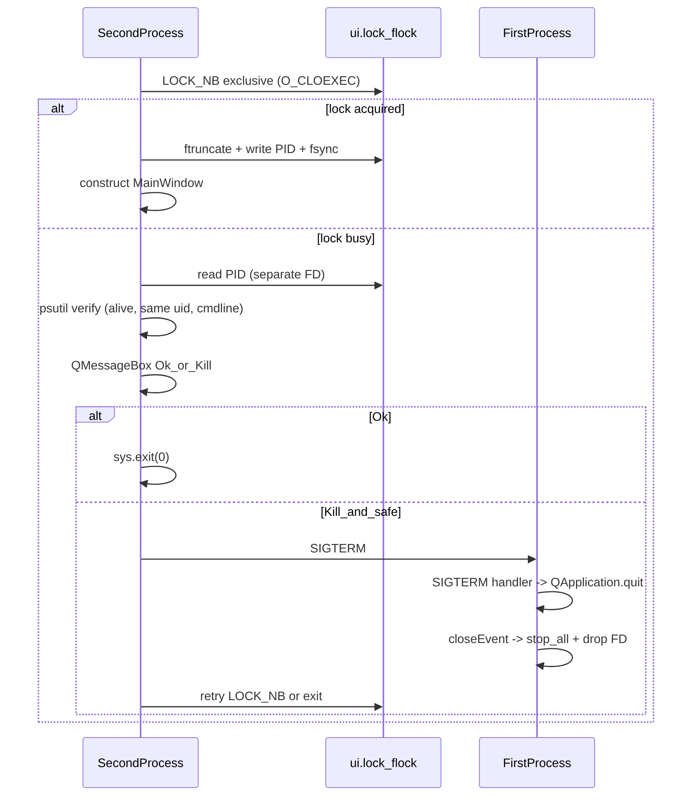

# Persist operator sidebar + single-instance UI

**Overview:** JSON prefs under user config dir; Linux-only singleton via `fcntl.flock` on `ui.lock` opened with `O_CLOEXEC` (kernel releases lock on crash — no stale flock; child processes do not inherit it); per-user scope only; second launch shows Ok/Kill dialog with psutil-checked Kill that signals `SIGTERM` → first instance routes the signal into `QApplication.quit()` → graceful `closeEvent` → child processes stopped.

## Implementation checklist

- [ ] Add JSON load/save for Acquisition Settings (operator sidebar); atomic write; `preferences_version` field; persist combo *text* (not converted forms); hook save on successful quit before worker teardown.
- [ ] Linux-only `fcntl.flock` on `config_dir/ui.lock` opened with `O_CLOEXEC` (FD held for lifetime; not inherited by child processes; crash-safe); acquire **before** constructing `MainWindow`.
- [ ] Second-instance `QMessageBox` Ok/Kill + psutil-checked `SIGTERM`; first instance installs a `signal.signal(SIGTERM, …)` handler that calls `QApplication.quit()` so children are stopped via `closeEvent` → `_process_manager.stop_all()`.
- [ ] Round-trip prefs test, malformed-JSON/clamp test, Linux-only flock contention + `O_CLOEXEC` test.

---

## Context

- Stack: **PySide6** desktop app; entry point is `main()` in [`src/splash_timepix/ui/main.py`](src/splash_timepix/ui/main.py).
- The **left sidebar** in [`OperatorTab._setup_ui`](src/splash_timepix/ui/operator_tab.py) holds **Acquisition Settings**: TDC frequency, TDC channel/edge, callback batch size, `n_bins`, duration, output path (matches the keys returned by [`OperatorTab._get_params`](src/splash_timepix/ui/operator_tab.py)). Pipeline queues and statistics are **display-only** — do not persist.
- [`MainWindow.closeEvent`](src/splash_timepix/ui/main.py) centralizes shutdown. Save prefs only when the window actually quits (`event.accept()` path), not when the user chooses “Stay” on the acquisition warning.

**Out of scope unless requested:** top-bar view controls, calibration spinboxes, ROI toggles, window geometry.

---

## 1. Persist Acquisition Settings — JSON vs QSettings

**Recommendation: use JSON.**

| Aspect | JSON file | QSettings |
|--------|-----------|-----------|
| Inspect/edit | Easy (`cat`, editor, backup) | OS-specific registry/plist paths |
| Portability | Explicit path logic | Qt picks native store |
| Dependencies | `json` stdlib only | PySide6 (already have) |

**Path:** Use a small helper (same module as singleton or `preferences.py`) resolving:

- `config_dir = Path(os.environ.get("XDG_CONFIG_HOME", Path.home() / ".config")) / "splash_timepix"`
- File: `config_dir / "operator_prefs.json"`

Create `config_dir` on save if missing. Use **atomic replace**: write to `operator_prefs.json.tmp` then `os.replace(...)` into final name.

**Contents:** Mirror `_get_params()` keys (`tdc_frequency`, `callback_batch_size`, `n_bins`, `duration`, `output_dir`) **plus the raw combo text** as `tdc_channel_text` and `tdc_edge_text`. The converted forms returned by `_get_tdc_channel()` / `_get_tdc_edge()` (int `0`/`1`/`2` and lowercase `"rising"`/`"falling"`) cannot be round-tripped through `QComboBox.setCurrentText(...)`, which only matches displayed item text exactly (`"Both"`/`"1"`/`"2"`, `"Rising"`/`"Falling"`). Persist the displayed text and restore with `setCurrentText`. Include `preferences_version: 1` for future migrations.

**Validate/clamp on load** against the actual widget ranges (verified against `OperatorTab._setup_ui`):

- `tdc_frequency` ∈ `[0.1, 1e9]` (default `1000.0`)
- `callback_batch_size` ∈ `[1, 10_000_000]` (default `10_000`)
- `n_bins` ∈ `[500, 50_000]` (default `10_000`)
- `duration` ∈ `[1, 19_008_000]` (default `60`)
- `tdc_channel_text` ∈ `{"Both","1","2"}`; `tdc_edge_text` ∈ `{"Rising","Falling"}` — drop unknown values back to defaults and log a warning.

After applying values, call [`_sync_output_path_tooltip`](src/splash_timepix/ui/operator_tab.py) so the tooltip reflects the loaded path.

**API on `OperatorTab`:** `load_operator_preferences()` at the end of `__init__` after `_setup_ui()`; `save_operator_preferences()` from [`MainWindow.closeEvent`](src/splash_timepix/ui/main.py) **immediately after the "Stay" branch and before worker teardown** (so a save exception cannot leave workers/processes running). Wrap in `try/except`; log warnings on I/O failure; never block quit. Saves on a hard kill / segfault are intentionally lost — JSON only updates on a clean exit; autosave on every widget edit is out of scope.

---

## 2. Single instance — scope, POSIX flock, crashes

### Machine-wide vs per-user (TimePix exclusivity)

If the goal is **“only one session anywhere may talk to the TimePix,”** that is a **hardware / OS policy** problem: two Unix accounts each running their own UI under **`~/.config/...`** does **not** stop both from touching the device unless something else enforces it (udev, single seat, beamline convention, etc.).

**Agreed plan:** enforce **at most one UI per Linux user** via a lock under that user’s config dir (same `splash_timepix` directory as `operator_prefs.json`). Cross-user blocking is **explicitly out of scope** for this feature.

POSIX **named semaphores** or **`fcntl.flock`** both tie the reservation to a **process lifetime**: when the process dies, the kernel releases it — same crash story as below. **`flock` on a dedicated lock file** is simpler for **Kill** (store PID in the file for the dialog) and avoids semaphore cleanup edge cases.

**Platform:** **Linux only** for singleton + flock; **no Windows parity** required for this feature (skip or no-op elsewhere if someone runs the UI on Windows).

### Stale lock after crash — why flock does not brick the next start

Use advisory **`fcntl.flock(LOCK_EX | LOCK_NB)`** on an FD opened with **`O_CLOEXEC`** to **`config_dir / "ui.lock"`**, and **keep that FD open for the entire process lifetime** (module-level reference in `single_instance.py`, or attribute on `QApplication`). **Do not** register an `atexit` handler that closes the FD early — let the kernel drop the lock at process exit.

**`O_CLOEXEC` is essential:** `ProcessManager` spawns Serval / streaming-server / live-cli / simulator as children. Without `O_CLOEXEC`, those children inherit the lock FD, and `flock` is only released once the *last* inheriting FD closes. If the UI segfaults but Serval is still running, a fresh launch would see the lock as busy until Serval also exits. Setting `O_CLOEXEC` at open time (or `os.set_inheritable(fd, False)` immediately after) prevents inheritance entirely.

When the process exits **for any reason** (clean quit, segfault, `SIGKILL`, power loss on local FS), the kernel **closes FDs and drops all locks** held by that process. The **`ui.lock` path may still exist on disk**, but it is **not locked**; the next launch **obtains `LOCK_EX` successfully**. Do **not** unlink `ui.lock` on shutdown — `flock` does not require it, and unlinking races with concurrent launches.

What **would** block wrongly is a **different** pattern: e.g. treating “PID file exists” as locked **without** flock, or NFS mounts with broken flock semantics (unusual on a local beamline workstation — **avoid locking over NFS**).

**Why `flock` and not `lockf`/`fcntl(F_SETLK)`:** `flock` is per-FD and (with `O_CLOEXEC`) does not propagate across fork/exec; POSIX record locks are per-process and are released when *any* of the process's FDs to that file closes — a classic footgun if a helper module incidentally opens and closes the same path.

**PID file write — race-free sequence:**

```python
fd = os.open(lock_path, os.O_RDWR | os.O_CREAT | os.O_CLOEXEC, 0o600)
fcntl.flock(fd, fcntl.LOCK_EX | fcntl.LOCK_NB)   # raises BlockingIOError if busy
os.ftruncate(fd, 0)
os.write(fd, str(os.getpid()).encode())
os.fsync(fd)
# keep fd open for the whole process lifetime
```

The PID is written **only after** acquiring flock, so the second instance never reads a stale PID from a previous crashed run. **Authoritative “someone is running”** is flock failure, not file contents — the PID is used solely for the Kill UX.

### UX (no foreground activation)

Second launch, executed in `main()` **after** `QApplication(...)` is constructed (needed for the `QMessageBox`) but **before** `MainWindow(...)` is constructed (so the second instance does not spin up `_setup_workers()` only to tear it down):

1. Try to acquire **non-blocking** flock on `ui.lock`.
2. If success → write PID (sequence above), keep FD open until exit; continue with `MainWindow(...)` and `window.show()`.
3. If failure → another holder is alive (or path edge case): show **`QMessageBox`**:
   - Text: another session is already running (short hint: close that window first).
   - **Ok** → `sys.exit(0)`.
   - **Kill** → attempt **safe termination** only if straightforward (below); otherwise fall back to messaging.

### Kill — straight talk

**Feasible (Linux, same user).** Open the lock file separately (no flock), read PID, then verify with **`psutil`** ([already a dependency](pyproject.toml)) before signaling:

```python
proc = psutil.Process(pid)        # raises NoSuchProcess if PID is dead
assert proc.is_running()
assert proc.uids().real == os.getuid()
assert any(marker in " ".join(proc.cmdline())
           for marker in ("tpx-ui", "splash_timepix.ui.main"))
```

If **all** checks pass → `os.kill(pid, SIGTERM)`, then poll `proc.is_running()` every 100 ms for up to 5 s. If still alive, prompt for `SIGKILL` (gated, **not** automatic — the first instance may legitimately be inside Serval/live-cli teardown). On disappearance, retry `flock` once; if it still fails, exit and ask the user to relaunch.

**First instance must route `SIGTERM` through `closeEvent`.** Default Python `SIGTERM` handling kills the process abruptly, which would orphan Serval / streaming-server / live-cli (they are spawned as children of the UI). In `main()`, after `QApplication(...)`, install:

```python
import signal
signal.signal(signal.SIGTERM, lambda *_: QApplication.quit())
```

`QApplication.quit()` posts a quit event that fires `MainWindow.closeEvent`, which already calls `_process_manager.stop_all()` and joins the worker threads. Without this handler, the second instance’s “Kill” leaves child processes running.

**Scope:** Kill only targets the PID in **this user’s** lock file (same uid); no cross-user signals. **Stale PID reuse** after our process died is mitigated by the cmdline check above.

**Fallback if Kill is too brittle on your platforms:** Implement dialog with **Ok** only, or **Kill** disabled with text: *Close the existing TimePix UI window, or power-cycle the detector / workstation if it is stuck.*

---

## Architecture sketch (second instance)



---

## Tests

Add to `tests/`:

- `test_preferences.py`
  - Round-trip: write a fully-populated `operator_prefs.json`, load, assert all values restored. The two combos must restore via `setCurrentText` (so the *displayed* text round-trips).
  - Malformed JSON / missing keys → defaults retained, no exception escapes.
  - Out-of-range values clamped (e.g. `n_bins=10`, `duration=-1`, `tdc_frequency=1e12`) → clamped to nearest in-range default; warning logged.
  - Atomic write: `operator_prefs.json.tmp` does not remain after a successful save (verifies `os.replace` path).
- `test_single_instance.py` (mark Linux-only; skip elsewhere)
  - Acquire flock in process A; `LOCK_EX | LOCK_NB` from B raises `BlockingIOError`. Close A’s FD; B succeeds.
  - PID written to file is the holder’s PID; reading from a separate FD without flock returns it.
  - `O_CLOEXEC` set on the lock FD: `fcntl.fcntl(fd, fcntl.F_GETFD) & fcntl.FD_CLOEXEC` is truthy.
  - `psutil` cmdline / uid checks reject mismatched processes (parametrize with a sleep child whose cmdline lacks the marker).

---

## Files to touch

| File | Change |
|------|--------|
| [`src/splash_timepix/ui/operator_tab.py`](src/splash_timepix/ui/operator_tab.py) | `load_operator_preferences` / `save_operator_preferences`; persist raw combo text (`tdc_channel_text`, `tdc_edge_text`); clamp on load; call `_sync_output_path_tooltip` after load. |
| [`src/splash_timepix/ui/main.py`](src/splash_timepix/ui/main.py) | flock singleton gate + Ok/Kill dialog in `main()` **before** `MainWindow(...)`; install `SIGTERM → QApplication.quit()` handler; `closeEvent` calls `save_operator_preferences()` immediately after the “Stay” branch, wrapped in `try/except` (never blocks quit). |
| New [`src/splash_timepix/ui/single_instance.py`](src/splash_timepix/ui/single_instance.py) | `config_dir()` helper; `acquire_singleton_lock()` (returns FD with `O_CLOEXEC`, writes PID, raises on contention); `read_lock_pid()`; `terminate_other_instance(pid)` with psutil checks. Module-level reference keeps the lock FD alive for the whole process. |
| New [`src/splash_timepix/ui/preferences.py`](src/splash_timepix/ui/preferences.py) | Atomic JSON write/read; clamp helpers; `PREFERENCES_VERSION` constant; default-value table mirroring widget defaults. |

No new PyPI dependencies (`json`, `fcntl`, `signal`, `os` are stdlib on POSIX; `psutil` already present).
